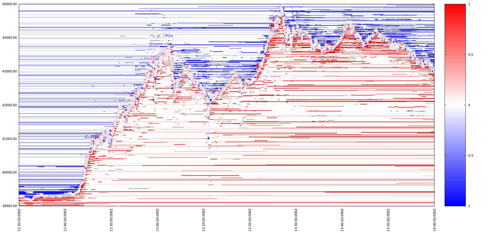
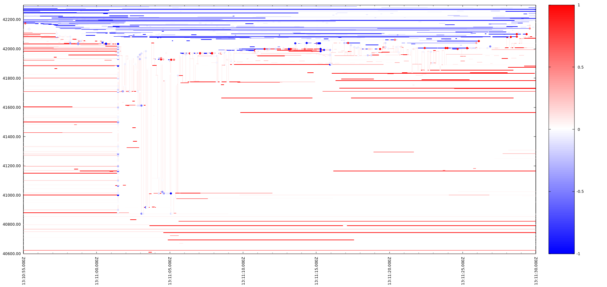

# Order Book Events ReconstructiON (OBERON)
A stand-alone application for collection of data that allows re-construction of a crypto currency exchange order book dynamics. Connects to an API of the specified exchange and produces `.csv` files called *eras* containing reconstructed [order events]((https://petr-fedorov.github.io/oberon/methods.html#order-and-trade)) in the **exchange-independent** format described [here](https://petr-fedorov.github.io/oberon/methods.html#save-output).

The collected data can be visualized and analyzed easily. Here is the visualization of the market reaction to Tesla, Inc. Form 10-K saying that the company ["invested an aggregate $1.50 billion in bitcoin ... may acquire and hold digital assets from time to time or long-term. Moreover, Tesla expects to begin accepting bitcoin as a form of payment for Tesla's products in the near future, subject to applicable laws and initially on a limited basis ..."](https://www.sec.gov/Archives/edgar/data/1318605/000156459021004599/tsla-10k_20201231.htm):

... and the visualization of an attempt at ~13:11:01 to reverse the growth:

See [here](https://petr-fedorov.github.io/oberon/) to understand how to re-construct the order book dynamics from these events.

## Installation

The installation instructions are for Debian 10 "buster".

The application is designed in BOUML -  a free UML 2 tool box including a modeler allowing you to specify and generate code in C++, Java, Idl, Php, Python and MySQL.

1. Install BOUML v7.10 or later as described [here](https://www.bouml.fr/download.html).
2. Install C++ Tool chain, OpenSSL, Boost and Qmake:

       apt install g++
       apt install qt4-qmake
       apt install libssl-dev
       apt install libboost-system-dev libboost-log-dev
3. Launch BOUML and open `bouml/oberon/oberon.prj` project
4. Generate C++ code for 'Standalone application' and `.pro` file for `<executable>oberon`. The code and .pro file will be generated in `/tmp/oberon/cpp` folder.

5. Make `build` folder and build the application:

       mkdir /tmp/oberon/build
       cd /tmp/oberon/build
       qmake /tmp/oberon/cpp/oberon.pro
       make

## Usage

      oberon <command> [options]

  where `<command>` is one of:

  * **capture** live order events from an exchange
  * **slice** an era file into several
  * **merge** several era files into one
  * **transmute** era files into the files of different formats that are more suitable for visualization and analysis

Common for all commands options are:

    -q [ --quote-increment ] arg (=0.01) specifies the minimum increment for the
                                         quote currency (i.e. USD in BTC-USD)
    -b [ --base-increment ] arg (=0.01)  specifies the minimum increment for the
                                         base currency (i.e. BTC in BTC-USD)
    -d [ --deleted ]                     output deleted events
    -h [ --help ]                        produce help message

Options that depend on the command are described below.

### **capture**

This command tells OBERON to capture live order events for a product on an exchange and save the events into one or more *era files* in an exchange-independent format described above. *Era file* always starts from a snapshot of an order book. The snapshot is followed by order events updating the snapshot so the state of the order book can be reconstructed at any moment.

**capture** command recognizes the following additional options:

    -e [ --exchange ] arg                specifies the exchange to capture data
                                         from (mandatory)
    -p [ --product ] arg                 specifies the exchange-specific code of
                                         the product to be captured (mandatory)
    -w [ --pong-wait-time ] arg (=1)     specifies the maximum waiting time for
                                         the webosocket pong response before
                                         re-connecting, secs
    -s [ --source ]                      output source of captured events
    -o [ --output-delay ] arg (=0)       a delay of output to enforce correct
                                         time order of events, seconds    

Supported values for `--exchange` and `--product` options are shown in the table below:

| `<exchange name>` | `<product>`|
|----|---|
|Coinbase| Any pair supported by [the full channel of Coinbase's websocket feed](https://docs.pro.coinbase.com/#the-full-channel) |
|Bitstamp| Any pair supported by [Bitstamp's Websocket API v2](https://www.bitstamp.net/websocket/v2/) "Live ticker" and "Live orders" channels|
|Bitfinex| TBD|
|KuCoin|TBD|

`quote-increment` and `base-increment` depend on the exchange and the product chosen.

Coinbase's [list of products](https://api.pro.coinbase.com/products/) contains parameters values for each pair. Bitstamp's [list of product](https://www.bitstamp.net/api/v2/trading-pairs-info/) provides  `counter_decimals` and `base_decimals` for each pair.

The event file will have its name in the following format: `<exchange name>_<product>_<timestamp>.csv`
where `timestamp` is the timestamp of the initial order book snapshot. The file starts from the events having this `timestamp` collectively producing the snapshot. The following messages in the file are updates of the snapshot.

There might be several files produced, with different `timestamp`s. That happens, for example, when an exchange websocket gets disconnected (i.e. when the exchange does not respond to ping messages longer than `--pong-wait-time` seconds). In this case the application quietly restarts and creates a new output file.

### **slice**

This command tells OBERON to slice an input era file into several smaller era files. The input era file is renamed (`.sliced` or `sliced.N` extension is added), the first sliced era file replaces the original file and the following sliced era files are named  as usual from exchange, product and their respective era timestamps.

**slice** command recognizes the following additional options:

    -i [ --input ] arg                   specifies the name(s) of an era file to
                                         be read (mandatory)
    -m [ --max-duration ] arg (=60)      specifies that a new era will be started
                                         every arg minutes since UNIX epoch

### **merge**

This command tells OBERON to merge several era files into a single file. The input era files are renamed (`.merged` or `merged.N` extension is added) and the new era file is named as the first input file.

**merge** command recognizes the following additional options:

    -i [ --input ] arg                   specifies the name(s) of an era file to
                                         be read (mandatory)

### **transmute**

This command tells OBERON to transmute each era files into five output files: four files with "stripes" and one file with "dots" as described below. These files are more suitable for visualization and analysis.

**transmute** command recognizes the following additional options:

    -i [ --input ] arg                    specifies the name(s) of an era file to
                                          be read (mandatory)

 The output files have the same name as the input `<era file name>` they are produced from with the following extensions added:

* **.bids** - contains stripes of all bids
* **.bids.best** - contains stripes of best bids only
* **.asks** - contains stripes of all asks
* **.asks.best** - contains stripes of best asks only
* **.trades** - contains "dots" representing trades

To visualize all five files run `gnuplot` and enter the following command:

    call "/tmp/oberon/cpp/depth.gp" "<era file name>" <min-price> <max-price> "<start-time>" "<end-time>"

For example, two visualizations shown above where produced by the following commands:

    call "/tmp/oberon/cpp/depth.gp" "Bitstamp_btcusd_2021-02-08T12-00-00.000000Z" 39000 45000 "2021-02-08T12:30:00.000000Z" "2021-02-08T14:00:00.000000Z"
    call "/tmp/oberon/cpp/depth.gp" "Bitstamp_btcusd_2021-02-08T12-00-00.000000Z" 40600 42300 "2021-02-08T13:10:55.000000Z" "2021-02-08T13:11:30.000000Z"

Stripes represent commitments to buy or sell certain volumes of base currency at given quote prices from the moment commitments appeared on an exchange order book until they ceased or changed. Red stripes are bids and blue stripes are asks. Saturation of colors represent absolute value of a commitment volume.

Note that stripes often originate from several maker orders.

Dot usually correspond to a single trade. Red dots are buys and blue are sells. Similarly, saturation of the color represents volume and white dots are actually either red or blue but their amount is too close to zero to be seen.  Note that sells are visualized by `gnuplot` as blue dots on red stripes and buys - as red dots on blue stripes.

Sometimes a single dot may correspond to several trades that happened simultaneously at the same price (but with different maker orders). In this case the Dot's `volume` is an aggregated volume of these trades.

"Stripes" files have the following format:

|timestamp|price|duration|volume
| --- | ---| --- |---|

   * `timestamp` - ISO 8601 timestamp of the stripe start, with microseconds
   * `price` - price, in quote currency
   * `duration` - duration of the stripe, in seconds
   * `volume` - bid amount (positive) or ask amount(negative), in base currency

"Dots" file has the following format:

|timestamp|price|volume
| --- | ---| --- |

* `timestamp` - ISO 8601 timestamp of the Dot, with microseconds
* `price` - price, in quote currency
* `volume` - sell amount (positive) or buy amount(negative), in base currency
